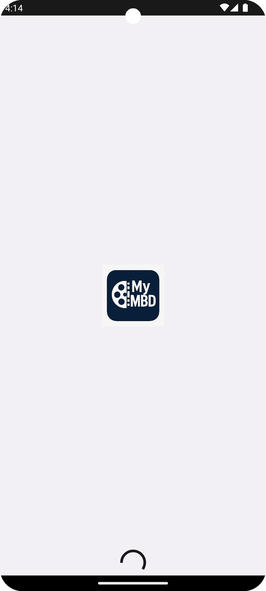
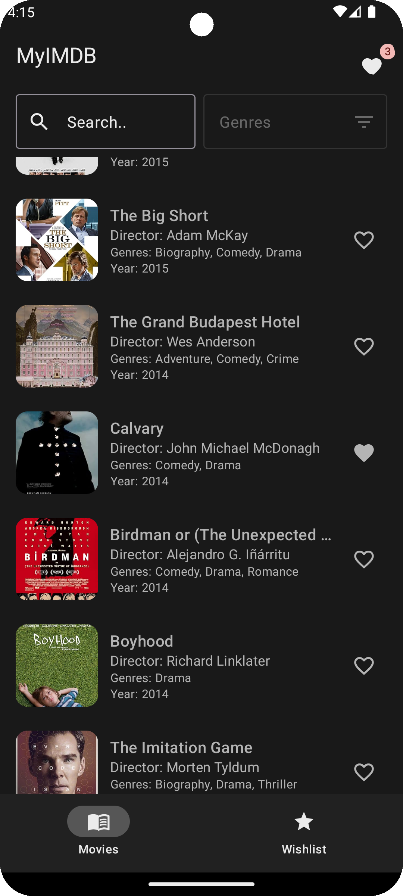
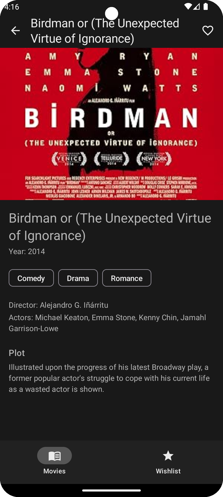
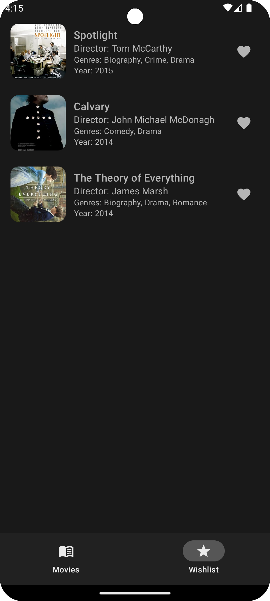

# MyIMBD - Modern Android Movie App

A modern Android application built using **Multi-Module Clean Architecture** with **Jetpack Compose** for the UI.  
The app displays a list of movies, allows users to search and filter by genres, view detailed movie information, and manage a wishlist.

---

## 📂 Project Architecture

The project follows **Clean Architecture** principles and is organized into the following modules:

1. **`app`**  
   - Application-level configurations and entry point.
   - Dependency injection setup.

2. **`domain`**  
   - Contains business logic and use cases.
   - Defines repository interfaces.

3. **`data`**  
   - Implements repositories and data sources.
   - Manages local (Room DB, DataStore) and remote API calls.

4. **`presentation`**  
   - Jetpack Compose UI screens and ViewModels.
   - Handles UI state and user interactions.

---

## 🛠️ Tech Stack

- **Language:** Kotlin
- **UI:** Jetpack Compose
- **Dependency Injection:** Hilt
- **Local Database:** Room
- **Preferences Storage:** DataStore
- **Architecture:** Multi-module Clean Architecture (app, domain, data, presentation)
- **Networking:** Retrofit 
- **Paging:** Paging 3 library

---

## ✨ Features

- **Initial Data Fetch Logic**  
  - **First Launch:** Fetches movies from an online API and stores them locally.  
  - **Subsequent Launches:** Loads movies from the local Room database for offline-first experience.

- **Movie List Screen**  
  - Displays paginated list of movies.  
  - Search movies by title or content.  
  - Filter movies by genres.  
  - Wishlist icon with badge showing number of items.  
  - Click on a movie item to view details.
  - Click on the heart icon to the movie item to add to wishlist

- **Movie Details Screen**  
  - Displays detailed information about the selected movie.

- **Wishlist Screen**  
  - View all movies added to the wishlist.  
  - Remove movies from wishlist.

---

## 📸 Screenshots

|  Splash| Movie List | Movie Details | Wishlist |
|------------|----------------|---------------|----------|
|  |  |  | |

---
## APK
[](https://github.com/TausifUddinAhmed/MyIMBD-Modern-Movie-App/raw/main/apk/MyIMDB.apk)

## 🚀 Getting Started

### Prerequisites
- Latest  Android Studio Narwhal Feature Drop
- JDK 11 or higher
- Gradle 8.x
### Setup
1. Clone the repository:
   ```bash
   git clone https://github.com/TausifUddinAhmed/MyIMBD-Modern-Movie-App.git
   cd MyIMBD-Modern-Movie-App


